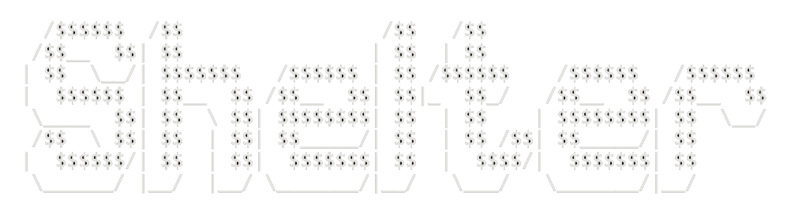

> ⚠️ **Work in Progress**  
> Shelter is in active development. Many features are experimental or incomplete.  
> Please use with care, and expect frequent changes as we build this together.

Shelter is a blockchain-based system for storing and distributing humanitarian aid in a faster, low-cost, secure, and transparent way—**designed for recipients with basic phones, even in low-connectivity environments where no WiFi is required. Powered by Soroban smart contracts and the Stellar network.

---

## 🌍 What Is Shelter?

Shelter is a digital safe built on smart contracts, designed to securely hold aid that can be accessed by individuals in need. It serves displaced individuals, refugees, and vulnerable communities—providing them with agency and empowerment.

While Shelter was originally built for humanitarian aid disbursement—recognizing that people in crisis need not only physical shelter but also a secure place for their funds—its programmability makes it a flexible solution that can power a wide range of use cases: Lending Pools, Payroll Distribution, Disaster Relief, Anticipatory Aid, UBI and Social Assistance, Remittances, Education Grants, Event-Based Rewards, and more.

---

## 💡 How It Works (In Simple Terms)

- **Donors** send tokens (like USDC) directly to the Shelter.
- **Stewards / Admins** — trusted NGOs or community partners — manage the flow of aid: setting up who can access it, when, and how.
- **Recipients** (individuals in need) receive access through secure codes, phone interfaces, or other simple tools — no crypto knowledge required.
- **Shelter Smart Contract** — a transparent, programmable digital safe for holding and managing funds.

---

## 🔐 Why Shelter?

- ✅ A more secure place for individuals to access and store funds in times of need
- ✅ Protects aid from misuse or mismanagement  
- ✅ Can operate even in fragile or low-infrastructure environments  
- ✅ Offers full visibility for donors and stakeholders  
- ✅ Built with agency, empowerment, and usability in mind

---

## 🧑‍🤝‍🧑 Who Is It For?

- **Humanitarian organizations** seeking a transparent, accountable way to deliver digital aid  
- **Refugees and displaced individuals** who need easy, secure access without advanced devices or Wi  
- **Communities** recovering from crisis or rebuilding after displacement
- **Builders, develoopers and web3 innovators** looking to contribute to open, impactful public infrastructure

